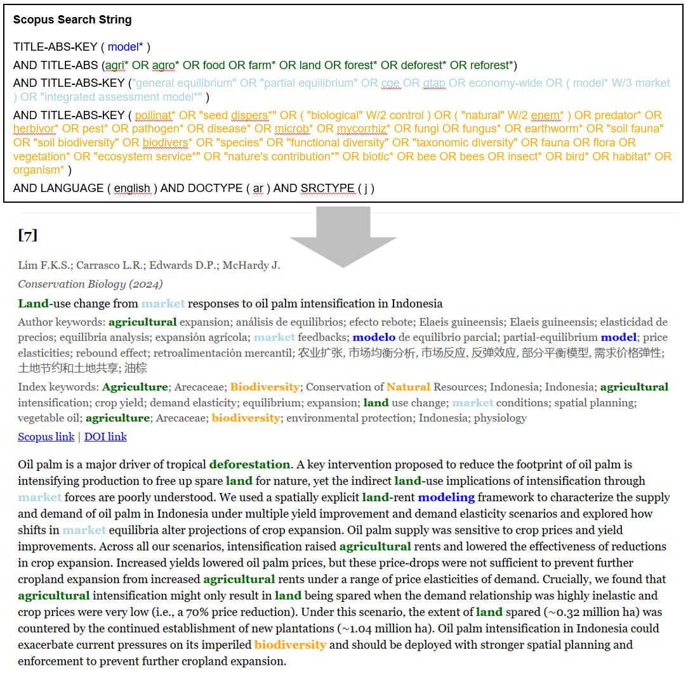

# An introductory note
The following text is reproduced from Github, where the code is hosted and can be downloaded:

https://github.com/t-g-williams/highlight-abstracts

# Highlight Keywords in Scopus Abstracts

An R utility to color-highlight keyword groups in a set of titles/abstracts/keywords exported from Scopus.

As an example, here is the search terms from my literature review and the output for a single abstract:

## Why might you want this?
If you're doing a systematic literature review, you'll probably need to read through a lot of abstracts. 
This can be monotonous, but with the right tools maybe you'll even find it fun? :-)

This file has served two purposes for me throughout the literature review process:
1. **Helping to refine the search terms:** Sometimes you have a keyword in your search that attracts a lot of false positives. It can be useful to remove such keywords to reduce the overall number of results you need to screen. This tool helps you to identify these by putting all abstracts in one file (allowing quick CTRL+F searching) and making your keywords "pop" with the colors and bold text.
2. **Making abstract screening faster:** When doing abstract screening, you need to quickly make a call about whether each result might meet your inclusion criteria. Making your keywords "pop" makes this a LOT faster, as you can more quickly find the relevant information.

**Note:** There are online tools (e.g. Rayyan) that are designed to help with abstract screening and also utilise AI in some ways. 
I experimented with these, but found them clunky. It also felt like it took some power out of my hands, and I didn't want to become dependent on an unknown software or locked-in to needing to pay for the premium version at a later stage. 
So I made this tool for myself. Maybe you find it useful too.

## Inputs
- A CSV file export of your query from Scopus (including abstracts!)

## Outputs
- A HTML file with color-highlighted titles/abstracts/keywords and hyperlinks for all of your Scopus results. An example is in the `example_outputs/` directory here.

## Instructions
1. Get your Scopus CSV export:
    - Run your search in Scopus
    - Click Export > CSV
    - Increase the document number so all results are exported
    - Select the group "Abstract & keywords" in addition to the pre-selected fields
    - Click export
    - Move the file to the same directory as this code.

2. Specify the `main()` function in the R file:
    - Specify your Scopus search terms. These are grouped into the different clauses from your search (e.g. I have a query that is structured like (model terms) AND (agrifood terms) AND (market terms) AND (environmental terms))
    - Assign desired colors to each search term group
    - Specify your working directory and the name of your Scopus CSV file
    - Optional settings: (a) shuffle the abstract order; (b) run for a subset of the abstracts (for testing/debugging)

3. Run the `highlight_abstracts.R` file and check the output in `outputs/scopus_bolded.html` :-)

## Caveats
- The code allows for a wildcard ("\*") in a search term (e.g. "analys\*" will match with "analysis", "analyses" etc.), but does not work with some fancier Scopus things like ("w/n") (i.e. search terms within a number of words of each other)
- Also, I think Scopus does some behind-the-scenes English generalisation - e.g. if you write "analyse", scopus will also check "analyze". This code does not do that, so you'll have to do that yourself manually here by adding extra keywords.
- I do not promise that this file works universally. You might need to modify some things to fit your needs.

